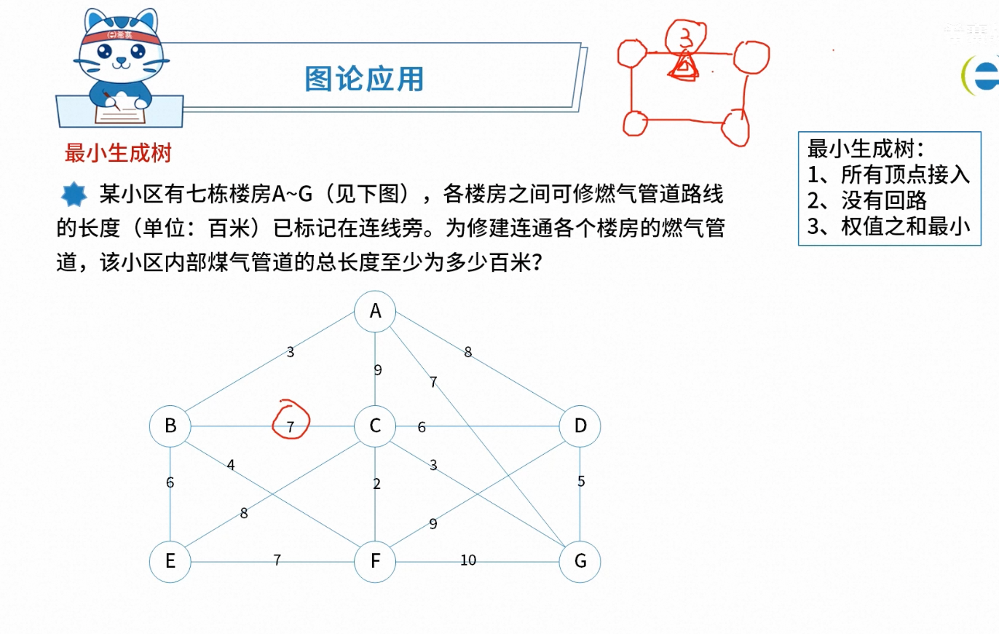
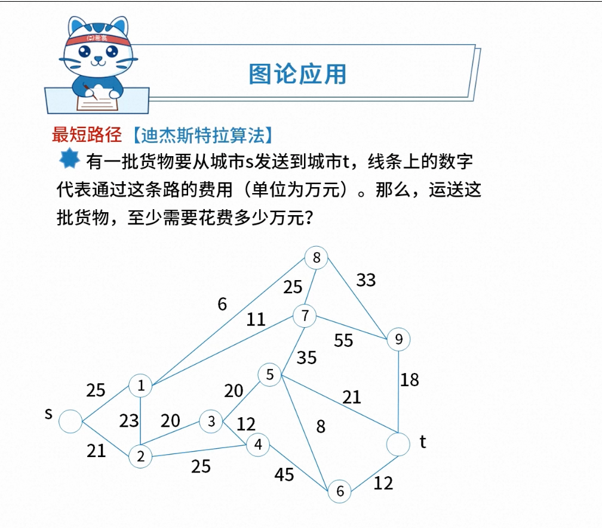

## 2 数学与经济管理章节概述
### 2.1 数学统计基础
### 2.2 图论应用 🌟🌟
```markdown
# 重要考点
- 最小生成树
- 最短路径
- 网络与最大流量
```
#### 2.2.1 最小生成树

<b>解决方案</b>
- 克鲁斯kal算法：最短边
    要求从最短边开始算起。如果边已经存在，则不考虑。 所以最后的结果校验：边的数量 为 顶点 - 1
- Prim算法：最近顶点
    从每个顶点出发，选取相邻最近的距离的边。所以最后的结果校验：边的数量 为 顶点 - 1

#### 2.2.2 最短路径

<b>解决方案</b>
- Dijkstra算法：

### 2.3 预测与决策 🌟

### tips
最短路径和关键路径的区别最短路径：从A到B的最短节点。
关键路径：从A到B，且A和B之间要全覆盖所有节点。

### 2.4 网络与最大流量


<b>解决方案</b>
- 题目明确了抽法，优先按照题目要求的去抽。
- 没明确的场景，按照贪心策略：从大到小去抽。（注意，不是最优方案）

<b>练习题目</b>

C

### Questions
1. 贪心
2. 关键路径是什么