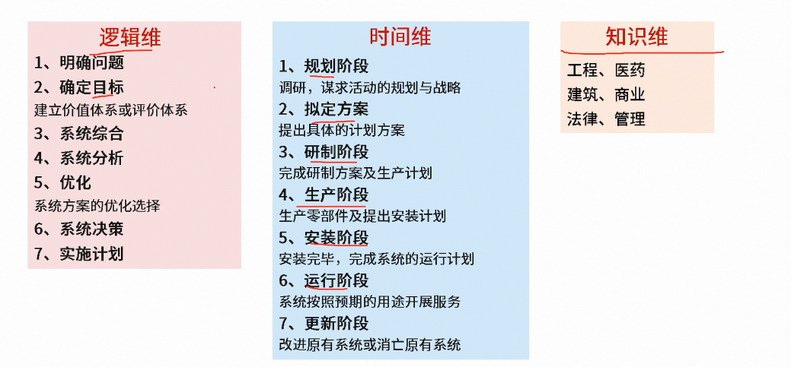

## 1. 信息的概念及特点

### 信息的定义

信息就是不确定性的减少

### 信息的特点

1. 客观性[真伪性]：真实是信息的中心价值，信息分主观信息和客观信息，主观信息必然转换成客观信息。	
2. 普遍性：物质决定精神，物质的普遍性决定了信息的普遍存在。
3. 无限性：客观世界是无限的，信息总量是无限的，每个具体事物能产生的信息是无限的。
4. 动态性：信息 随着时间的变化而变化。
5. 相对性：不同主体从同一事物中获取的信息以及信息量可能是不同的。
6. 依附性：信息是客观世界的真实反映，信息需要依附一定的载体。信息不能完全脱离物质独立存在。
7. 变换性：信息通过处理可以实现变换或转换。
8. 传递性：信息在时间上是存储的。在空间上是转移或扩散的。
9. 层次性：客观世界是分层的，信息也是分层的。
10. 系统性：不同类别的信息可形成不同的载体。
11. 转换性：信息可转换物质或能量

##  系统工程方法论

### 概念
【系统工程】从整体出发、从系统观念出发，以求【整体最优】

| 系统工程方法                                                 | 关键点                                                       |
| ------------------------------------------------------------ | ------------------------------------------------------------ |
| 霍尔三维结构 "<b>硬科学</b>"方法论 | <b>逻辑维</b>：逻辑维即<b>解决问题的逻辑过程</b>。 <b>时间维</b>：时间维即是<b>工作进程</b>。 <b>知识维</b>：知识维即是<b>专业科学知识</b>。 应用场景：组织和管理大型工程建设项目 |
| 切克兰德方法 "<b>软科学</b>"方法论 | 核心不是"<b>最优化</b>"，而是"<b>比较</b>"和"<b>探寻</b>" <b>7步骤</b>：<b>认识问题、根底定义、建立概念模型、比较及探寻、选择、设计与实施、评估与反馈</b> |
### 示例

