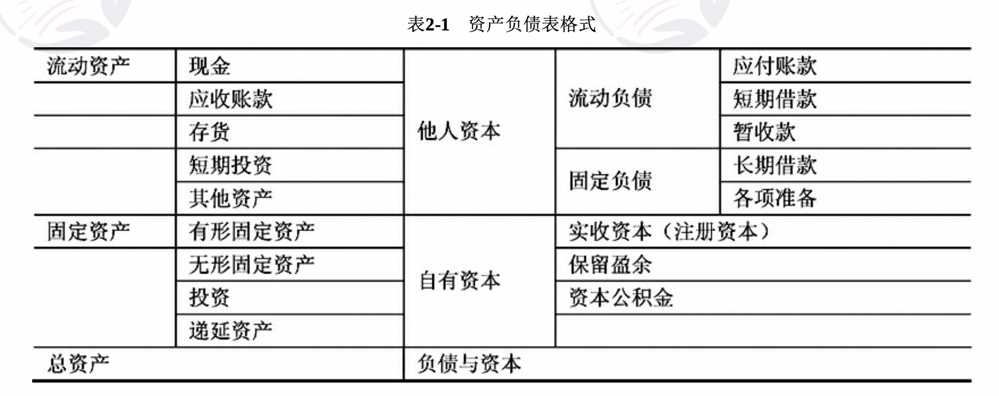

## 第一章 绪论

### 1.1 信息与信息系统
#### 1.1.1 信息的基本概念

- 特征
- 功能
- 两个相关的概念：信息与数据，信息与知识

#### 1.1.2 系统及相关理论

- 特性：整体性、层次性、目的性、稳定性、突变性、自组织性、相似性、相关性和环境适应性
- 任务：系统论的任务不仅在于认识系统的特点和规律，更重要的还在于利用这些特点和规律去控制、管理、改造或创造系统，使得系统的存在、发展更符合人们的需要。
- 系统理论：由于研究的视角 不同，研究者背景不同等原因，系统论还没有形成一个统一的理论体系，还是处在不停的 演变和发展过程中，综合各种研究成果，大致包括8个基本原理（整体性原理，突变原理，层次性原理，开放性原理，目的性原理，互塑共生原理，秩序原理，生命周期原理）
- 信息系统：简单地说，信息系统就是输入数据，通过加工处理，产生信息的系统。面向管理是信息系统的显著特点，以计算机为基础的信息系统可以定义为，结合管理理论和方法，应用信息技术解决管理问题，为管理决策提供支持的系统。管理模型、信息处理模型和系统实现条件三者的结合，产生信息系统

#### 1.1.3 系统工程方法论

- 系统工程是从整体出发合理开发、设计、实施和运用系统科学的工程技术。它根据总体协调的需要，综合应用自然科学和社会科学中有关的思想、理论和方法，利用计算机作为工具，对系统的结构、元素、信息和反馈等进行分析，以达到最优规划、最优设计、最优管理和最优控制的目的。
    - 霍尔三维：（时间维，逻辑维，知识维）
    - 切克兰德方法：（问题现状说明、根底定义、建立概念模型、比较、实施）

#### 1.1.4 信息系统工程

- 信息系统工程是以系统工程的方法来实现信息系统建设的过程。信息系统工程是系统工程的一个分支，它以系统工程的方法来构建、设计、实施和运用信息系统。

1. 信息系统的生命周期（系统规划，系统分析，系统设计，系统实现，系统运行与评价）
2. 信息系统建设的原则（高层管理人员介入原则，用户开发原则，自顶向下规划原则，工程化原则）

### 1.2 系统分析师
#### 1.2.1 系统分析师的角色定位
    系统分析师应该是一类有很强和事业心和使命感，并且能从实际出发解决具体问题，具有务实精神的杰出复合型人才。
- 信息化的人才结构
    1. 横向（IT和非IT）
    2. 纵向（上层-决策层-CEO，CFO，CIO等高层领导人员，中层-管理业务层-中层经理，系统分析师，经济师，会计师等人员，下层-操作层-程序员，运维工程师，测试工程师等基层单位业务人员）
- 系统分析师的角色
    1. IT专家
    2. 管理业务专家
    3. IT人员和非IT人员的沟通者
    4. 对外谈判者
    5. 信息系统运行的指导者
    6. 信息系统建设项目的技术负责人
- 系统分析师的素质要求
    1. 具有深入观察问题的能力，逻辑思维能力和归纳能力
    2. 具有丰富的开发实践经验，具有丰富的想象力和创造力，敢于接受新鲜事物，善于从经验的积累中进行创新。
    3. 具有较强的学习能力，能熟练掌握系统开发的基本原理，精通信息系统的各种开发方法和技术。
    4. 具有很强的谈判和协商能力，以及人机交往能力，善于将自己对系统的认知介绍给用户，并说服用户接受自己的主张。
    5. 具有很强的组织能力和管理能力。能对工程师和程序员进行指导，确保项目成功。
    6. 具有与他人合作共事的能力。
    7. 具有一定的远见和前瞻能力。
- CIO是系统分析师的典型代表

#### 1.2.2 系统分析师的任务

- 战略管理中的任务
- 基础建设中的任务
- 系统建设中的任务
- 企业流程管理中的任务
- 信息资源开发利用中的任务

#### 1.2.3 系统分析师的知识体系
1. 技术知识与技能
    计算机系统知识，计算机科学与技术知识，计算机网络知识，系统与安全知识，信息系统工程知识，数学以及相关学科知识，经济管理知识
2. 经营管理知识与技能
    人际沟通知识，人际关系知识，项目管理知识，企业管理知识，市场营销知识。
3. 业务知识与技能
    对于IT行业来说，每次承接的项目都可能位于不同的行业，因此需要具有很强的学习能力，快速熟悉用户业务领域相关的知识，由外行迅速转变为“业内人士”。
4. 人文修养

## 第二章 经济管理与应用数学

### 2.1 会计常识
会计是指记录、分类、汇总、计量和报告发生在企业经济活动中财务数据的行为。 向投资者公开披露财务报告是上市公司的法定义务，也是上市公司会计工作的一项重要内容。

1. 会计功用：可以分为一般功用和证券市场上的功用
2. 会计计价：确定一项资产的价值

### 2.2 会计报表
会计报表是综合反映企业资产、负债和所有者权益的情况及一定时期的经营成果和现金流量的书面文件，是企业经营状况的公开报告。

#### 2.2.1 资产负债表（财务状况表）
反映企业在特定的日期财务状况的报表。

#### 2.2.2 利润表与利润分配表
- 利润表：利润表的格式分为单步式和多步式。会计制度要求会计使用多步式。
- 利润分配表：反映企业在一定期间内对实现利润进行分配或对造成亏损进行弥补的会计报表。

### 2.3 现代企业组织结构
企业组织结构是企业组织内部各个构成要素相互作用的联系方式或形式，以求有效、合理地把成员组织起来，为实现共同目标而协同努力。
#### 2.3.1 企业组织结构模式