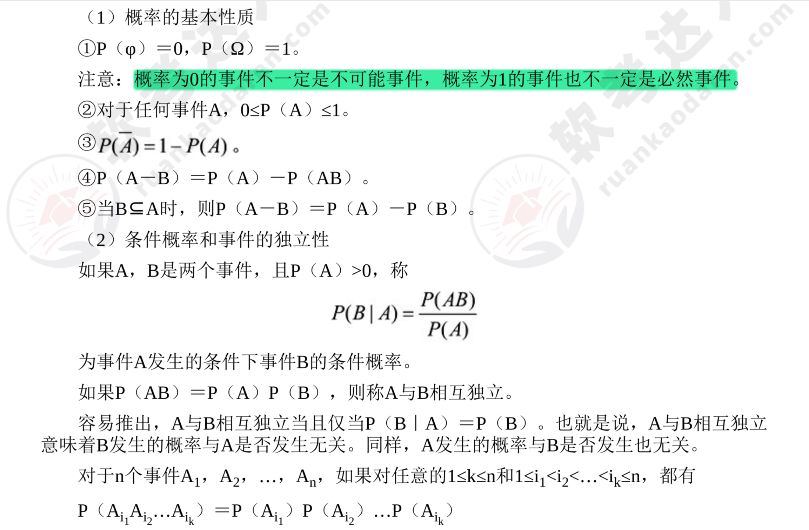
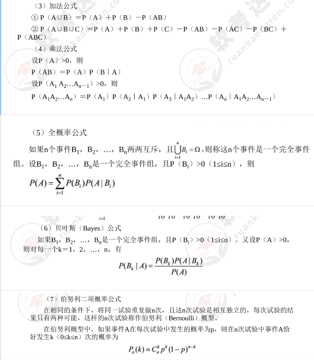

## 第一章 绪论

### 1.1 信息与信息系统
#### 1.1.1 信息的基本概念

- 特征
- 功能
- 两个相关的概念：信息与数据，信息与知识

#### 1.1.2 系统及相关理论

- 特性：整体性、层次性、目的性、稳定性、突变性、自组织性、相似性、相关性和环境适应性
- 任务：系统论的任务不仅在于认识系统的特点和规律，更重要的还在于利用这些特点和规律去控制、管理、改造或创造系统，使得系统的存在、发展更符合人们的需要。
- 系统理论：由于研究的视角 不同，研究者背景不同等原因，系统论还没有形成一个统一的理论体系，还是处在不停的 演变和发展过程中，综合各种研究成果，大致包括8个基本原理（整体性原理，突变原理，层次性原理，开放性原理，目的性原理，互塑共生原理，秩序原理，生命周期原理）
- 信息系统：简单地说，信息系统就是输入数据，通过加工处理，产生信息的系统。面向管理是信息系统的显著特点，以计算机为基础的信息系统可以定义为，结合管理理论和方法，应用信息技术解决管理问题，为管理决策提供支持的系统。管理模型、信息处理模型和系统实现条件三者的结合，产生信息系统

#### 1.1.3 系统工程方法论

- 系统工程是从整体出发合理开发、设计、实施和运用系统科学的工程技术。它根据总体协调的需要，综合应用自然科学和社会科学中有关的思想、理论和方法，利用计算机作为工具，对系统的结构、元素、信息和反馈等进行分析，以达到最优规划、最优设计、最优管理和最优控制的目的。
    - 霍尔三维：（时间维，逻辑维，知识维）
    - 切克兰德方法：（问题现状说明、根底定义、建立概念模型、比较、实施）

#### 1.1.4 信息系统工程

- 信息系统工程是以系统工程的方法来实现信息系统建设的过程。信息系统工程是系统工程的一个分支，它以系统工程的方法来构建、设计、实施和运用信息系统。

1. 信息系统的生命周期（系统规划，系统分析，系统设计，系统实现，系统运行与评价）
2. 信息系统建设的原则（高层管理人员介入原则，用户开发原则，自顶向下规划原则，工程化原则）

### 1.2 系统分析师
#### 1.2.1 系统分析师的角色定位
    系统分析师应该是一类有很强和事业心和使命感，并且能从实际出发解决具体问题，具有务实精神的杰出复合型人才。
- 信息化的人才结构
    1. 横向（IT和非IT）
    2. 纵向（上层-决策层-CEO，CFO，CIO等高层领导人员，中层-管理业务层-中层经理，系统分析师，经济师，会计师等人员，下层-操作层-程序员，运维工程师，测试工程师等基层单位业务人员）
- 系统分析师的角色
    1. IT专家
    2. 管理业务专家
    3. IT人员和非IT人员的沟通者
    4. 对外谈判者
    5. 信息系统运行的指导者
    6. 信息系统建设项目的技术负责人
- 系统分析师的素质要求
    1. 具有深入观察问题的能力，逻辑思维能力和归纳能力
    2. 具有丰富的开发实践经验，具有丰富的想象力和创造力，敢于接受新鲜事物，善于从经验的积累中进行创新。
    3. 具有较强的学习能力，能熟练掌握系统开发的基本原理，精通信息系统的各种开发方法和技术。
    4. 具有很强的谈判和协商能力，以及人机交往能力，善于将自己对系统的认知介绍给用户，并说服用户接受自己的主张。
    5. 具有很强的组织能力和管理能力。能对工程师和程序员进行指导，确保项目成功。
    6. 具有与他人合作共事的能力。
    7. 具有一定的远见和前瞻能力。
- CIO是系统分析师的典型代表

#### 1.2.2 系统分析师的任务

- 战略管理中的任务
- 基础建设中的任务
- 系统建设中的任务
- 企业流程管理中的任务
- 信息资源开发利用中的任务

#### 1.2.3 系统分析师的知识体系
1. 技术知识与技能
    计算机系统知识，计算机科学与技术知识，计算机网络知识，系统与安全知识，信息系统工程知识，数学以及相关学科知识，经济管理知识
2. 经营管理知识与技能
    人际沟通知识，人际关系知识，项目管理知识，企业管理知识，市场营销知识。
3. 业务知识与技能
    对于IT行业来说，每次承接的项目都可能位于不同的行业，因此需要具有很强的学习能力，快速熟悉用户业务领域相关的知识，由外行迅速转变为“业内人士”。
4. 人文修养

## 第二章 经济管理与应用数学

### 2.1 会计常识
会计是指记录、分类、汇总、计量和报告发生在企业经济活动中财务数据的行为。 向投资者公开披露财务报告是上市公司的法定义务，也是上市公司会计工作的一项重要内容。

1. 会计功用：可以分为一般功用和证券市场上的功用
2. 会计计价：确定一项资产的价值

### 2.2 会计报表
会计报表是综合反映企业资产、负债和所有者权益的情况及一定时期的经营成果和现金流量的书面文件，是企业经营状况的公开报告。

#### 2.2.1 资产负债表（财务状况表）
反映企业在特定的日期财务状况的报表。

#### 2.2.2 利润表与利润分配表
- 利润表：利润表的格式分为单步式和多步式。会计制度要求会计使用多步式。
- 利润分配表：反映企业在一定期间内对实现利润进行分配或对造成亏损进行弥补的会计报表。

### 2.3 现代企业组织结构
企业组织结构是企业组织内部各个构成要素相互作用的联系方式或形式，以求有效、合理地把成员组织起来，为实现共同目标而协同努力。
#### 2.3.1 企业组织结构模式
- U型结构：企业内部按职能（例如，销售、开发等）划分成若干部门，各部门独立性很小，均由企业高层领导直接进行管理，即企业实行集中控制和统一指挥。
- M型结构：战略决策和经营决策分离。
- 矩阵制结构：既有按职能划分的垂直领导系统，又有按产品（项目）划分的横向领导关系的结构
    - 多维结构（立体结构）：在矩阵制结构的基础上构建产品利润中心、地区利润中心和专业成本中心的三维立体结构。若再加时间维可构成四维立体结构。
- H型结构：多个法人实体集合的母子体制，母子之间主要靠产权纽带来连接。
- 模拟分权结构：在H型结构的基础上，将母子公司中的母公司进行分权，形成分权结构。
- 团队型结构：企业内部按职能划分成若干团队，团队间相互独立，由团队内的成员自行进行管理。
- 网络型结构：企业内部按职能划分成若干网络，网络间相互独立，由网络内的成员自行进行管理。

#### 2.3.2 企业组织结构设计
- 不同的企业可以具有不同的组织结构，同一个企业在不同的发展阶段也可以具有不同的组织结构。在组织设计的时候，要遵循八大原则：（任务目标原则、分工协作原则、统一指挥原则、合理管理幅度原则、责权对等原则、集权和分权原则、执行部门与监督部门分设原则、协调有效原则）
### 2.4 业绩评价
- 对企业各级主管的业绩评价， 大致可分为成本中心，利润中心和投资中心，其中投资中心属于最高层。
### 2.5 企业文化管理
- 全体员工所认同并遵守的、带有本组织特点的使命、愿景、宗旨、精神、价值观和经营理念，
#### 2.5.1 企业文化的内容
- 经营哲学，价值观念，企业精神，企业道德，团体意识，企业形象，企业制度
#### 2.5.2 企业文化管理的作用
- 增强企业核心竞争力（导向，约束，凝聚，激励，调试，辐射）
    企业文化管理的作用需要在企业具有良好的获利能力的前提。不同阶段的应该有不同的企业管理文化。

### 2.6 IT审计
IT审计（信息系统审计）是为了信息系统的安全、可靠与有效，由独立于审计对象的IT审计师，以第三方的客观立场对以计算机为核心的信息系统进行综合的检查与评价，向IT审计对象的最高领导层，提出问题与建议的一连串的活动。

### 2.7 概率统计应用
概率论与数理统计作为一门学科，主要是研究现实生活中的数据和客观世界中的随机现象，它通过对数据收集、整理、描述和分析，以及对事件发生可能性的刻画，来帮助人们作出合理的判断和预测。

#### 2.7.1 古典概率应用

人们在客观世界中所观察到的现象大致可以分为两类（确定现象和随机现象）。
- 事件（和事件，积事件，差事件，逆事件，互斥事件）
- 概率：在不变的条件下，重复做n次试验，设n次试验中事件A发生m次。如果当n很大时，频率m/n稳定地在某一数值p的附近摆动，而且随着n的增大，这种摆动的幅度越小，则称数值p为事件A的概率，记作P(A)=p

#### 2.7.2 随机变量及其分布 （不明白）
- 一种随机现象含有的随机事件不止一个，为了全面刻画随机现象，揭示随机现象的统计规律，需要引入随机变量的概念。
- 离散型随机变量
- 连续型随机变量
- 二维离散型随机变量
- 二维连续型随机变量

#### 2.7.3 随机变量的数字特征（不明白）
- 数学期望，方差

#### 2.7.4 常用分布 (不明白)
- <b>0-1分布（伯努利分布），二项分布，几何分布，泊松分布，均匀分布，正态分布</b>

#### 2.7.5 常用统计分析方法
- 数理统计以概率论为理论基础，收集、整理试验或观察得到的数据，将获得的数据进行分析和推理，从而对研究对象的客观规律作出合理的估计和判断。
- 常用的统计量（样本均值，样本方差，样本标准差，样本k阶原点矩，样本k阶中心矩，次序统计量）
- 参数估计（点估计，区间估计）
- 假设检验
- 回归分析
- 方差分析
- 正交实验法

### 2.8 图论应用
图论是数学的一个分支，它研究的是图（graph）的基本性质和基本操作。

#### 2.8.1 最小生成树
- 最小生成树（Minimum Spanning Tree）是图论中一个重要的概念，它是指在给定图上，选择一棵树，使得树中所有顶点都在图上，且树中所有边都在图上，且树中所有边都是图上所有边中权值之和最小的一棵树。
-  Kruskal算法：每次从图上选择权值最小且与树中顶点不重复的边， until 树中所有边都加入
- Prim算法：贪心的策略，每次构建的树中加入权值最小且与树中顶点不重复的边。

#### 2.8.2 最短路径

- 迪杰斯特拉算法（红点集）

#### 2.8.3 网络与最大流量
- 属于特殊的线性规划问题

### 2.9 组合分析
- 组合分析是离散数学中的一个重要组成部分，它研究的对象是排列和组合问题。系统分析师理解并掌握处理排列和组合问题的基本策略，ᨀ高分析和解决问题的能力，培养探索和创新意识。

#### 2.9.1 排列组合
- 计数原理基础（乘法原理和加法原理）
- 排列（设S为具有n个不同元素的n元集，从S中选取r个元素且考虑其顺序称为“S的一个r排列”，不同排列的总数记为 有时也用P（n，r）表示）
- 组合（设S为具有n个不同元素的n元集，从S中选取r个元素（不考虑其顺序）称为“S的一个r组合”，不同组合的总数记为 有时也用C（n，r）或 表示）

#### 2.9.2 抽屉原理和容斥原理
- 抽屉原理（鸽巢原理）（狄利克雷原理）
- 容斥原理（需要用到 德摩根定理）

### 2.10 算法的选择与应用
- 算法就是为解决某个问题而设计的步骤和方法。

#### 2.10.1 非数值算法
- 非数值算法用于对非数值信息进行查找、排序等操作。
1. 查找算法
    - 顺序查找，二分查找，分块查找，哈希查找，
2. 排序算法
    - 插入排序，简短选择排序，冒泡排序，快速排序，希尔排序，堆排序，归并排序，外排序

#### 2.10.2 数值算法
- 数值算法用于解决一般数学解析方法难以解决的问题，例如，求超越方程的根、求定积分、解微分方程等。
1. 误差分析（模型误差，观测误差，截断误差，舍入误差，过失误差，绝对误差，相对误差）
2. 穷举搜索法（逐一验证法）穷举搜索法的要点在于“穷举”，即必须列出所有可能的候选解，然后逐一验证。
3. 迭代法（从某个点出发，通过某种方式求出下一个点，此点应该离方程（组）的解更近一步，当两者之差接近到可以接受的精度范围时，就认为找到了问题的解。）
4. 递推法（找出递推关系式，确定初值）
5. 递归法（找出递归关系式，确定初值）
6. 分治法（将问题分解为若干个规模较小的问题，然后分别求解，最后将解合并）
7. 回溯法（利用了深度优先算法，在求解的过程中，找到合适的中间项，在这个方向继续走下去，直到无路可走，然后开始会说。直到无法回溯）
8. 贪心法（快速得出满意解，但无法保证最优解。在有最优子结构问题中尤为有效）
9. 动态规划法（可以按区间（时间或者空间）划分，每个区间得出最优解）
10. 随机模拟法（建立一个和系统相似的实验模型。反复实验，预测系统行为）

### 2.11 运筹方法
- 运筹学是近代应用数学的一个分支，主要是将生产、管理等事件中出现的一些带有普遍性的运筹问题加以提炼，然后利用数学方法进行解决。（确定目标、制订方案、建立模型、制订解法。）

#### 2.11.1
- 网络计划技术（用网络分析的方法编制的计划称为网络计划，它是一种编制大型工程项目进度计划的有效方法。）
    关键路径，网络优化，综合实例，计划评审技术（PERT，CPM）

#### 2.11.2 线性规划
线性规划是研究在有限的资源条件下，如何有效地使用这些资源达到预定目标的数学方法。
 - 图解法和单纯形法

#### 2.11.3 决策论
    管理的核心就是决策。
- 决策的分类（按性质的重要性分类，按决策的结果分类，按定量和定性分类，按决策环境分类，按决策过程的连续性分类）
- 决策过程和模型（面向结果和面向过程）
- 不确定型决策
- 风险决策（风险决策是指决策者对客观情况不甚了解，但对将发生各事件的概率是已知的。）